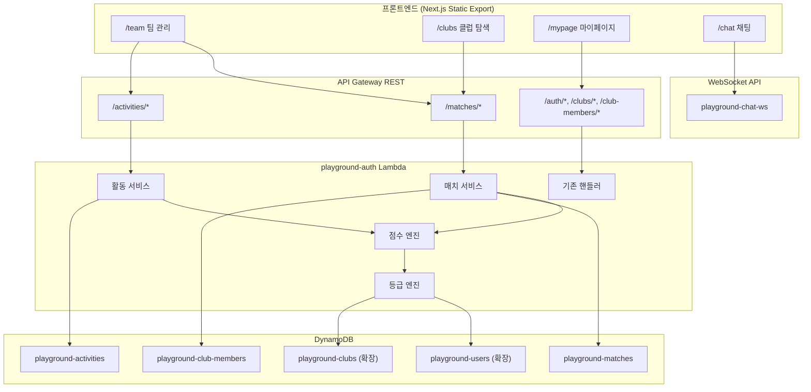
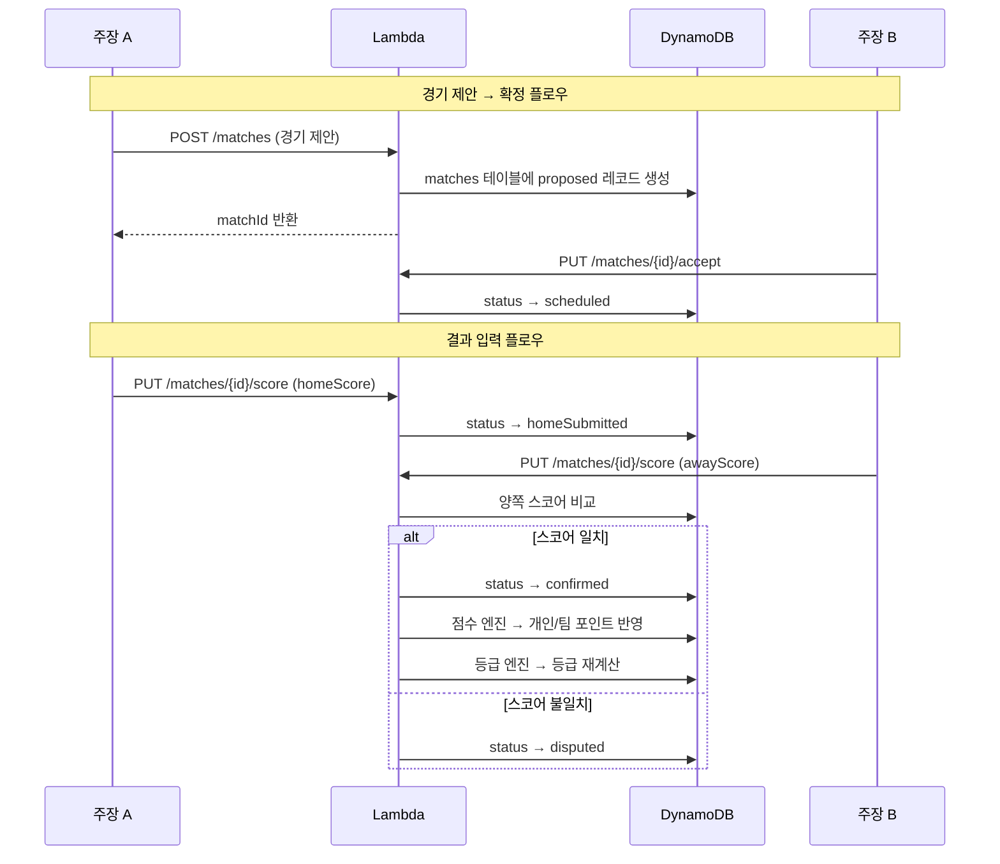
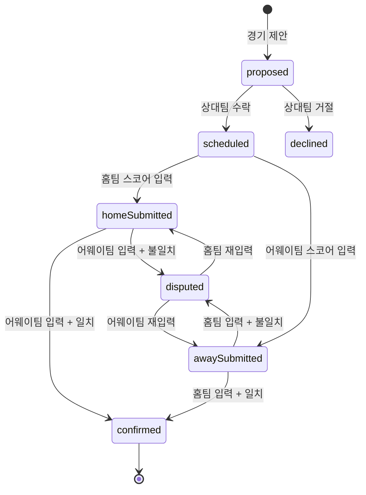

# 설계 문서: 등급/티어 시스템

## 개요

스포츠 플랫폼에 종합 등급/티어 시스템을 구현한다. 기존 단일 Lambda(playground-auth) 아키텍처를 확장하여 매치 관리, 활동 관리, 점수 산정, 등급 결정 기능을 추가한다.

핵심 설계 원칙:
- 기존 아키텍처(단일 Lambda + DynamoDB + API Gateway) 유지
- 점수 산정/등급 결정 로직을 순수 함수로 분리하여 테스트 용이성 확보
- 프론트엔드는 Next.js static export 제약 유지 (CSR only)
- DynamoDB 신규 테이블 2개(playground-matches, playground-activities) 추가 + 기존 테이블 필드 확장

## 아키텍처

### 시스템 구조



### 처리 흐름




## 컴포넌트 및 인터페이스

### 1. 백엔드 API 엔드포인트 (playground-auth Lambda 확장)

기존 `backend/auth/index.mjs`의 handler에 새 라우트를 추가한다.

#### 매치 서비스 API

| 메서드 | 경로 | 설명 | 인증 |
|--------|------|------|------|
| POST | `/matches` | 경기 제안 생성 | 필요 (주장) |
| GET | `/matches?clubId={id}` | 팀별 매치 목록 조회 | 필요 |
| PUT | `/matches/{matchId}/accept` | 경기 제안 수락 | 필요 |
| PUT | `/matches/{matchId}/decline` | 경기 제안 거절 | 필요 |
| PUT | `/matches/{matchId}/score` | 스코어 입력 | 필요 (주장) |
| PUT | `/matches/{matchId}/goals` | 골 기록 추가 | 필요 (주장) |

#### 활동 서비스 API

| 메서드 | 경로 | 설명 | 인증 |
|--------|------|------|------|
| POST | `/activities` | 활동 일정 제안 | 필요 |
| GET | `/activities?clubId={id}` | 팀별 활동 목록 조회 | 필요 |
| PUT | `/activities/{activityId}/join` | 활동 참가 | 필요 |
| PUT | `/activities/{activityId}/complete` | 활동 완료 | 필요 (제안자) |

### 2. 점수 엔진 (ScoreEngine)

순수 함수로 구현하여 테스트 용이성을 확보한다. `backend/auth/index.mjs` 내에 모듈로 포함.

```javascript
// 점수 산정 순수 함수
function calculateMatchPoints(result, winStreak) {
  // result: "win" | "draw" | "loss"
  // returns: { points, newWinStreak }
  const base = 3; // 참여 포인트
  const bonus = result === "win" ? 4 : result === "draw" ? 1 : 0;
  const streakBonus = result === "win" && winStreak >= 1 ? winStreak : 0;
  const newStreak = result === "win" ? winStreak + 1 : 0;
  return {
    points: base + bonus + streakBonus,
    newWinStreak: newStreak,
  };
}

// 골 포인트 산정
function calculateGoalPoints(goalCount) {
  return goalCount * 2;
}

// 활동 포인트 (고정)
function calculateActivityPoints() {
  return 5;
}
```

### 3. 등급 엔진 (RatingEngine)

포인트 기반 등급 결정 순수 함수.

```javascript
// 개인 등급 결정 (축구/풋살)
function determinePlayerTier(points) {
  if (points >= 701) return "P";
  if (points >= 301) return "SP";
  if (points >= 101) return "A";
  if (points >= 25) return "S";
  return "B";
}

// 팀 등급 결정 (축구/풋살)
function determineTeamTier(tp) {
  if (tp >= 2001) return "Legend";
  if (tp >= 801) return "Elite";
  if (tp >= 251) return "Crew";
  if (tp >= 51) return "Club";
  return "Rookie";
}
```

### 4. 프론트엔드 컴포넌트

#### 팀 관리 페이지 (/team) 확장

기존 `TeamPageContent` 컴포넌트에 다음 섹션을 추가:

- **팀 등급 뱃지**: 팀 정보 영역에 등급 뱃지 표시
- **경기 제안 섹션**: proposed 상태 매치 목록 + 수락/거절 버튼
- **최근 경기 기록 섹션**: confirmed 매치 목록 (상대팀, 스코어, 결과, 날짜) + 골 기록 추가 버튼
- **활동 일정 섹션**: 동아리형 스포츠일 때 활동 제안/참가/완료 UI
- **멤버 등급 뱃지**: 멤버 목록에 개인 등급 뱃지 표시
- **멤버 채팅 버튼**: 멤버 옆 1:1 채팅 버튼

#### 클럽 탐색 페이지 (/clubs) 확장

- **클럽 카드에 팀 등급 뱃지 추가**: 기존 클럽 카드 UI에 등급 뱃지 오버레이
- **경기 제안 버튼 연동**: 실제 매치 API 호출로 변경

#### 마이페이지 (/mypage) 확장

- **종목별 개인 등급 뱃지 섹션**: ratings 데이터 기반 등급 뱃지 표시

#### 등급 뱃지 공통 컴포넌트

```typescript
// components/RatingBadge.tsx
interface RatingBadgeProps {
  tier: string;
  type: "player" | "team";
  size?: "sm" | "md" | "lg";
}

// 개인 등급 색상 매핑
const playerTierColors = {
  B: { bg: "bg-gray-500/20", text: "text-gray-400", label: "비기너" },
  S: { bg: "bg-green-500/20", text: "text-green-400", label: "스타터" },
  A: { bg: "bg-blue-500/20", text: "text-blue-400", label: "아마추어" },
  SP: { bg: "bg-purple-500/20", text: "text-purple-400", label: "세미프로" },
  P: { bg: "bg-fuchsia-500/20", text: "text-fuchsia-400", label: "프로" },
};

// 팀 등급 색상 매핑
const teamTierColors = {
  Rookie: { bg: "bg-gray-500/20", text: "text-gray-400", label: "루키" },
  Club: { bg: "bg-green-500/20", text: "text-green-400", label: "클럽" },
  Crew: { bg: "bg-blue-500/20", text: "text-blue-400", label: "크루" },
  Elite: { bg: "bg-purple-500/20", text: "text-purple-400", label: "엘리트" },
  Legend: { bg: "bg-fuchsia-500/20", text: "text-fuchsia-400", label: "레전드" },
};
```


## 데이터 모델

### 기존 테이블 확장

#### playground-users 테이블 확장

```json
{
  "email": "user@example.com",
  "name": "홍길동",
  "ratings": {
    "축구": {
      "tier": "A",
      "points": 150,
      "games": 30,
      "wins": 18,
      "winStreak": 2
    },
    "풋살": {
      "tier": "S",
      "points": 60,
      "games": 12,
      "wins": 8,
      "winStreak": 0
    }
  }
}
```

- `ratings`: Map 타입. 종목명을 키로 사용
- 각 종목별: `tier`(등급 코드), `points`(누적 포인트), `games`(경기 수), `wins`(승리 수), `winStreak`(현재 연승)

#### playground-clubs 테이블 확장

```json
{
  "clubId": "uuid",
  "name": "서울 FC 썬더",
  "teamRating": {
    "tier": "Club",
    "tp": 180,
    "games": 35,
    "wins": 22,
    "winStreak": 3
  }
}
```

- `teamRating`: Map 타입. `tier`(등급 코드), `tp`(팀 포인트), `games`(경기 수), `wins`(승리 수), `winStreak`(현재 연승)

### 신규 테이블

#### playground-matches 테이블

- Partition Key: `matchId` (String, UUID)
- GSI 1: `homeClubId-status-index` (PK: `homeClubId`, SK: `status`)
- GSI 2: `awayClubId-status-index` (PK: `awayClubId`, SK: `status`)

```json
{
  "matchId": "uuid",
  "homeClubId": "xxx",
  "awayClubId": "yyy",
  "sport": "축구",
  "date": "2026-03-07T15:00:00",
  "venue": "마포구민체육센터",
  "status": "proposed | scheduled | homeSubmitted | awaySubmitted | confirmed | disputed | declined",
  "homeScore": null,
  "awayScore": null,
  "homeSubmittedBy": null,
  "awaySubmittedBy": null,
  "confirmedAt": null,
  "goals": [],
  "createdBy": "captain@example.com",
  "createdAt": "2026-02-22T..."
}
```

매치 상태 전이:



#### playground-activities 테이블

- Partition Key: `activityId` (String, UUID)
- GSI: `clubId-status-index` (PK: `clubId`, SK: `status`)

```json
{
  "activityId": "uuid",
  "clubId": "xxx",
  "sport": "러닝크루",
  "date": "2026-03-08T07:00:00",
  "venue": "한강 반포지구",
  "createdBy": "member@example.com",
  "participants": ["member1@example.com", "member2@example.com"],
  "status": "open | completed",
  "completedAt": null,
  "createdAt": "2026-02-22T..."
}
```

### 주장 권한 검증 로직

매치 스코어 입력 및 골 기록 시 주장 권한을 검증한다:

```javascript
async function verifyCaptain(clubId, userEmail) {
  const club = await getClub(clubId);
  return club.captainEmail === userEmail;
}
```

- `playground-clubs` 테이블의 `captainEmail` 필드와 요청자 이메일을 비교
- 불일치 시 403 에러 반환: "주장만 결과를 입력할 수 있습니다"


## 정확성 속성 (Correctness Properties)

*속성(Property)이란 시스템의 모든 유효한 실행에서 참이어야 하는 특성 또는 동작이다. 속성은 사람이 읽을 수 있는 명세와 기계가 검증할 수 있는 정확성 보장 사이의 다리 역할을 한다.*

### Property 1: 대전형 스포츠 기본 점수 산정

*For any* 경기 결과(승리/무승부/패배)와 연승 횟수 0인 조합에 대해, `calculateMatchPoints`는 승리 시 7점, 무승부 시 4점, 패배 시 3점을 반환해야 한다.

**Validates: Requirements 1.1, 1.2, 1.3, 1.4**

### Property 2: 연승 보너스 및 초기화

*For any* 경기 결과와 현재 연승 횟수(0 이상의 정수)에 대해, `calculateMatchPoints`는 승리 시 연승 보너스 `max(0, winStreak)` 점을 추가하고 연승을 +1 증가시키며, 무승부/패배 시 연승을 0으로 초기화해야 한다.

**Validates: Requirements 1.5, 1.6, 1.7**

### Property 3: 골 기록 점수 산정

*For any* 0 이상의 골 수에 대해, `calculateGoalPoints`는 `goalCount * 2`를 반환해야 한다.

**Validates: Requirements 2.1, 7.3**

### Property 4: 골 포인트 팀 TP 미반영

*For any* 골 기록 이벤트에 대해, 골 포인트는 개인 누적 포인트에만 합산되고 팀 TP에는 반영되지 않아야 한다.

**Validates: Requirements 2.2, 2.3**

### Property 5: 개인 등급 결정 (축구/풋살)

*For any* 0 이상의 누적 포인트에 대해, `determinePlayerTier`는 0~24→B, 25~100→S, 101~300→A, 301~700→SP, 701+→P를 반환해야 한다.

**Validates: Requirements 3.1, 3.2, 3.3, 3.4, 3.5**

### Property 6: 팀 등급 결정 (축구/풋살)

*For any* 0 이상의 누적 TP에 대해, `determineTeamTier`는 0~50→Rookie, 51~250→Club, 251~800→Crew, 801~2000→Elite, 2001+→Legend를 반환해야 한다.

**Validates: Requirements 4.1, 4.2, 4.3, 4.4, 4.5**

### Property 7: 매치 상태 전이 정합성

*For any* 유효한 매치 상태와 액션 조합에 대해, 매치 상태 전이는 다음 규칙을 따라야 한다: proposed→(수락)scheduled/(거절)declined, scheduled→(홈입력)homeSubmitted/(어웨이입력)awaySubmitted, 양쪽 입력 완료 시 스코어 일치→confirmed/불일치→disputed.

**Validates: Requirements 5.1, 5.3, 5.5, 6.1, 6.2, 6.3, 6.5**

### Property 8: 주장 전용 권한 검증

*For any* 클럽과 사용자에 대해, 해당 사용자의 이메일이 클럽의 `captainEmail`과 일치하지 않으면 스코어 입력 및 골 기록 추가 요청이 거부되어야 한다.

**Validates: Requirements 6.6, 6.7, 7.4**

### Property 9: 동아리형 활동 완료 점수

*For any* 완료된 활동과 참가자 목록에 대해, 각 참가자에게 개인 5점이 부여되고 팀에 TP 5점이 부여되며, 연승 보너스는 적용되지 않아야 한다.

**Validates: Requirements 8.5, 8.6, 8.7**

### Property 10: 점수 산정 결정론

*For any* 유효한 경기 결과(승리/무승부/패배)와 연승 횟수 조합에 대해, `calculateMatchPoints`를 동일한 입력으로 두 번 호출하면 동일한 결과를 반환해야 한다.

**Validates: Requirements 14.1**

### Property 11: 점수 하한

*For any* 경기 결과에 대해, `calculateMatchPoints`가 반환하는 포인트는 최소 3점(참여 포인트) 이상이어야 한다.

**Validates: Requirements 14.2**

### Property 12: 등급 단조 증가

*For any* 두 포인트 값 p1, p2 (p1 ≤ p2)에 대해, `determinePlayerTier(p1)`의 등급 순서가 `determinePlayerTier(p2)`의 등급 순서보다 높지 않아야 한다. 팀 등급(`determineTeamTier`)에도 동일하게 적용된다.

**Validates: Requirements 14.3**

### Property 13: 매치 레코드 필수 필드 완전성

*For any* 생성된 매치 레코드에 대해, matchId, homeClubId, awayClubId, sport, status, createdAt 필드가 모두 존재하고 비어있지 않아야 한다.

**Validates: Requirements 5.6**

### Property 14: 활동 레코드 필수 필드 완전성

*For any* 생성된 활동 레코드에 대해, activityId, clubId, sport, createdBy, participants, status, createdAt 필드가 모두 존재하고 비어있지 않아야 한다.

**Validates: Requirements 8.2**


## 오류 처리

### 백엔드 오류 처리

| 상황 | HTTP 코드 | 메시지 |
|------|-----------|--------|
| 인증 토큰 없음/만료 | 401 | "토큰이 필요합니다" |
| 주장이 아닌 사용자의 스코어/골 입력 | 403 | "주장만 결과를 입력할 수 있습니다" |
| 존재하지 않는 매치 ID | 404 | "매치를 찾을 수 없습니다" |
| 존재하지 않는 활동 ID | 404 | "활동을 찾을 수 없습니다" |
| 잘못된 매치 상태 전이 (예: declined → scheduled) | 400 | "현재 상태에서 수행할 수 없는 작업입니다" |
| 이미 참가한 활동에 재참가 | 400 | "이미 참가한 활동입니다" |
| 필수 필드 누락 | 400 | "필수 항목이 누락되었습니다: {field}" |
| 자기 팀에 경기 제안 | 400 | "자기 팀에는 경기를 제안할 수 없습니다" |
| 스코어 음수 입력 | 400 | "스코어는 0 이상이어야 합니다" |
| DynamoDB 오류 | 500 | "서버 오류가 발생했습니다" |

### 프론트엔드 오류 처리

- API 호출 실패 시 `alert()` 또는 토스트 메시지로 사용자에게 알림 (기존 패턴 유지)
- 로딩 상태 표시: 각 API 호출 시 버튼 비활성화 + "처리 중..." 텍스트
- 네트워크 오류 시 재시도 안내 메시지
- 인증 만료 시 로그인 페이지로 리다이렉트

### 데이터 정합성 보호

- 매치 스코어 입력 시 DynamoDB 조건부 업데이트(ConditionExpression) 사용하여 동시 입력 방지
- 포인트 반영 시 원자적 업데이트(ADD 연산) 사용하여 동시성 문제 방지
- 매치 상태 전이 시 현재 상태 검증 후 업데이트 (낙관적 잠금)

## 테스트 전략

### 속성 기반 테스트 (Property-Based Testing)

라이브러리: **fast-check** (JavaScript/TypeScript용 PBT 라이브러리)

각 속성 테스트는 최소 100회 반복 실행하며, 설계 문서의 속성 번호를 태그로 참조한다.

테스트 대상 순수 함수:
- `calculateMatchPoints(result, winStreak)` → Property 1, 2, 10, 11
- `calculateGoalPoints(goalCount)` → Property 3
- `determinePlayerTier(points)` → Property 5, 12
- `determineTeamTier(tp)` → Property 6, 12

태그 형식: `Feature: rating-system, Property {number}: {property_text}`

```javascript
// 예시: Property 1 테스트
// Feature: rating-system, Property 1: 대전형 스포츠 기본 점수 산정
fc.assert(
  fc.property(
    fc.constantFrom("win", "draw", "loss"),
    (result) => {
      const { points } = calculateMatchPoints(result, 0);
      if (result === "win") return points === 7;
      if (result === "draw") return points === 4;
      return points === 3;
    }
  ),
  { numRuns: 100 }
);
```

### 단위 테스트

단위 테스트는 속성 테스트로 커버하기 어려운 구체적 예시, 엣지 케이스, 통합 포인트를 검증한다.

- 경기 확정 시 모든 멤버에게 포인트가 반영되는지 (통합 테스트)
- 골 기록 추가 후 개인 포인트만 증가하고 팀 TP는 변하지 않는지
- 매치 상태 전이 시 잘못된 전이가 거부되는지 (예: declined → scheduled)
- 주장 권한 검증 실패 시 403 에러 반환
- 활동 완료 시 참가자 전원에게 5점 부여
- 등급 경계값 테스트 (24→25, 100→101, 300→301, 700→701)
- 팀 등급 경계값 테스트 (50→51, 250→251, 800→801, 2000→2001)
- 빈 참가자 목록으로 활동 완료 시 처리
- 스코어 불일치 시 disputed 상태 전환

### 테스트 구성

```
backend/auth/
├── index.mjs                    # 기존 + 신규 핸들러
├── scoring.mjs                  # 점수/등급 순수 함수 (테스트 용이성)
├── __tests__/
│   ├── scoring.property.test.mjs  # 속성 기반 테스트
│   └── scoring.unit.test.mjs      # 단위 테스트
```

점수 산정 및 등급 결정 로직을 `scoring.mjs`로 분리하여 순수 함수 테스트를 용이하게 한다. 매치/활동 서비스 로직은 `index.mjs`에 유지하되, 점수 관련 함수는 import하여 사용한다.
